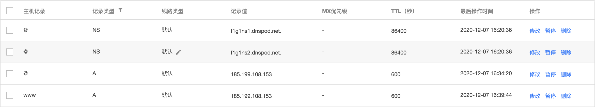

# seismo-learn 维护指南

本项目用于记录 seismo-learn 的相关信息。

## 基本信息

- 英文名：seismo-learn
- 中文名：地震"学"
- 主页：https://seismo-learn.org
- 发起人：
  - [@core-man](https://github.com/core-man)
  - [@seisman](https://github.com/seisman)

## 域名信息

- 所有者：
  - [@seisman](https://github.com/seisman) (购买者)
  - [@core-man](https://github.com/core-man) (有管理权限，可修改DNS，不能转移域名或删除域名)
- 有效期：2030-12-05
- 购买自：https://www.godaddy.com/

## DNS信息

DNS使用 [腾讯云](https://cloud.tencent.com/) 进行解析。

- 账户所有者: [@seisman](https://github.com/seisman)

具体操作：

1. 到 Godaddy 的“我的域名”->“域名设置”下，找到“管理DNS”
2. 修改域名服务器为 `f1g1ns1.dnspod.net` 和 `f1g1ns2.dnspod.net`
3. 前往腾讯云，添加域名
4. 为域名添加 `A` 记录，指定IP地址 `185.199.108.153`
5. 为域名添加 `www` 记录，指定IP地址 `185.199.108.153`

具体见下图:

## GitHub 组织

- 组织网址：https://github.com/seismo-learn
- [所有者](https://github.com/orgs/seismo-learn/people?query=role%3Aowner)：
  - [@core-man](https://github.com/core-man)
  - [@seisman](https://github.com/seisman)
